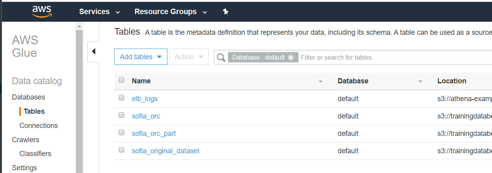
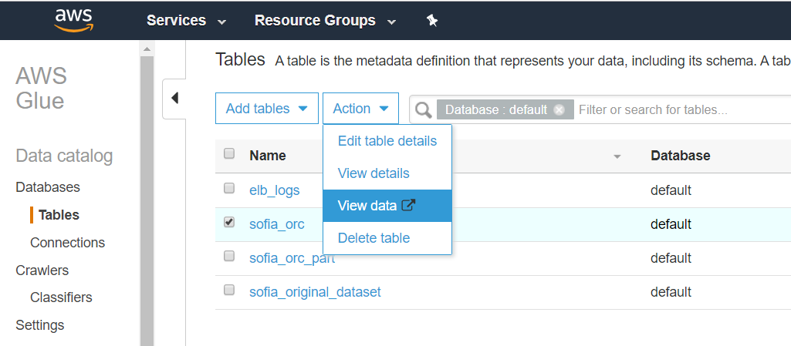

We will show how to leverage Glue Data Catalog with EMR

General documentation can be hound [here](https://docs.amazonaws.cn/en_us/emr/latest/ReleaseGuide/emr-metastore-external-hive.html)

# Exercise I - Create a EMR Cluster with Glue Data Catalog as external hive metastore

We will analyze the Sofia air quality data set https://airsofia.info/.

A copy of the dataset is stored in s3 bucket at s3://trainingdatabecloudata/sofia_air_quality/temp    
We will copy this data set to a bucket within your account and point EMR Hive to it

Follow these steps

* Create a bucket in your AWS account (accept default settings), try to give it a meaningful name
* Open on windows your command prompt
* Issue the following command to copy the dataset from original location to your bucket in S3 (if you havent done so already in previous exercises)

`
aws s3 cp s3://trainingdatabecloudata/sofia_air_quality/temp s3://$your_bucket/sofia_air_quality/temp --recursive  --profile $YOUR_PROFILE
`

* Create an EMR Cluster v 5.28 (shut down any other running EMR Clusters if you have them running)

* **NOTE**: We could use an older EMR Version but this time lets start the newest EMR Version
* Now ssh to master node and type
`
hive
`

* We will create 3 tables (sofia_original_dataset (CSV non partitioned table), 
sofia_orc (ORC non partitioned table) and sofia_orc_part (ORC partitioned table)) that will be available 
in Glue Data Catalog (and hence also in Athena). 

* Execute the following statement (substitute **$YOURBUCKET** with the name of the bucket you created) to
create the sofia_original_dataset table

`
CREATE EXTERNAL TABLE sofia_original_dataset (
api_call_id int,
sensor_id SMALLINT, 
location SMALLINT,
lat float, 
lon float,
event_timestamp string,
pressure float,
temperature float,
humidity float
)
ROW FORMAT DELIMITED
FIELDS TERMINATED BY ','
STORED AS TEXTFILE
LOCATION 's3://$YOURBUCKET/sofia_air_quality/temp'
tblproperties ("skip.header.line.count"="1");
`

* You may get an error with TEZ Execution  (try to execute select count(*) from sofia_original_dataset). If so then go to Athena Mgmt Console -
you will be prompted to setup a default s3 location for your Athena Query Results. 

* Create in S3 Mgmt Console within your bucket a directory called athena_query_results and set it on Athena Mgmt Console popup like on the image below: 

* To verify on Athena Mgmt Console execute the following query:

* If you succeed then verify in hive that the count query stated before in hive works now.

* Execute the following statement (substitute **$YOURBUCKET** with the name of the bucket you created) to
create the sofia_orc table:

`
CREATE EXTERNAL TABLE sofia_orc (
api_call_id int,
sensor_id int, 
location int,
lat float, 
lon float,
event_timestamp string,
pressure float,
temperature float,
humidity float
)
STORED AS ORC
LOCATION 's3://$YOURBUCKET/sofia_air_quality/sofia_orc'
;
`

`
INSERT INTO TABLE sofia_orc SELECT * FROM sofia_original_dataset;
`

* Execute the following statement (substitute **$YOURBUCKET** with the name of the bucket you created) to
create the sofia_orc_part table:

`
CREATE EXTERNAL TABLE sofia_orc_part (
api_call_id int,
sensor_id int, 
location int,
lat float, 
lon float,
event_timestamp string,
pressure float,
temperature float,
humidity float
)
partitioned by(yearmonth int)
STORED AS ORC
LOCATION 's3://$YOURBUCKET/sofia_air_quality/sofia_orc_part'
;
`

`
set hive.exec.dynamic.partition.mode=nonstrict;
`

`
INSERT OVERWRITE TABLE sofia_orc_part PARTITION(yearmonth) SELECT 
api_call_id,
sensor_id, 
location,
lat, 
lon,
event_timestamp,
pressure,
temperature,
humidity,
replace(substr(event_timestamp,1,7),'-','')
FROM sofia_original_dataset;
`

* If you havent done previously measure the time (from hive cli or hue) for each table how long the following SQLs execute:
    * count the data set size
    * select api_call_id where api_call_id < 100
    * count the number of measures in 201812
    
* Now move to Glue Data Catalog Mgmt Console and check if the above created tables are visible in Glue Data Catalog.
* Navigate to the default database:

* CLick on View Data

* On the Athena Query Editor run the queries you run on hive cli/hue ui and measure 2 things:
    * execution time
    * Data scanned
* What are you observations?

* Now lets create a second EMR cluster (please terminate the first one) and verify that it sees the tables registered with our first EMR Cluster.
* Head to EMR Console and create a second EMR Cluster (terminate the first one) like you created the first one. Dont forget to set this option:

* Now ssh to master node and type

`
hive
`

* Verify that the tables are visible in default schema. Execute the following commands to do so:

`
show databases;
`

`
hive> use default;
`

`
hive> show tables;
`

* You should see the tables registered in glue (elb_logs, sofia_orc, sofia_orc_part, sofia_original_dataset)

# Exercise II - Create new tables from Athena that will be available also in EMR CLuster (with Glue Data Catalog as external hive metastore) 

* Lets create some tables (partitioned, ORC format and compressed) from Athena and see if they will be available from a new EMR Cluster.

* Please login to Athena and select the default database

* In the Athena Mgmt console click on **_"Whats New"_**

* View the new announcements and click on the Oct 2018 announcement: https://docs.aws.amazon.com/athena/latest/ug/ctas.html

* Follow the link and read what can be done with this functionality

* Lets create 2 tables to check the functionality
   * **_First table named sofia_orc_v_athena_partitioned_** that
   * in stored in ORC format
   * compression is set to SNAPPY
   * path in s3 is set to 's3://$YOUR_BUCKET/sofia_orc_v_athena_partitioned/'
   * is partitioned by yearmonth
   * contains columns api_call_id, sensor_id, location, yearmonth
   * contains the data for 201903
   * **_Second table named sofia_orc_v_athena_partitioned_v2_** that
   * is like the first table except that
   * the source table is sofia_original_dataset
   * to leverage partitioning we need to supply an "$EXPRESSION as yearmonth"
   
* Can the 2 tables be created and queried?
* Take a look at s3 folder structure and the files created. What do you think?
* Now lets use our EMR Cluster created in previous exercise (or create a new EMR cluster with Glue Data Catalog as hive external metastore) and verify that it sees the tables created above.
* NOTE: If you would create a new EMR Cluster dont forget to set this option:

* Now ssh to master node and type

`
hive
`

* Verify that the new tables are visible in default schema. Execute the following commands to do so:

`
show databases;
`

`
hive> use default;
`

`
hive> show tables;
`

* You should see the new tables registered in glue (sofia_orc_v_athena_partitioned, sofia_orc_v_athena_partitioned_v2)

* Is this functionality important? What kind of use cases it enables?

   
    

